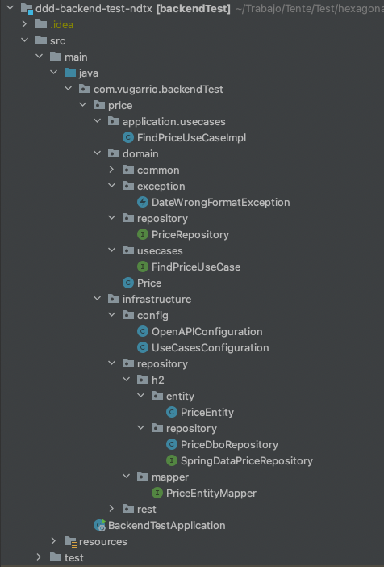

# DDD BackendTest Application

### Technological stack
* Spring Boot 2.7.10, Maven
* Java 11
* DDD and Hexagonal Arquitecture
* Testing: Junit5, Mockito
* Database: H2, Spring Data JPA
* Swagger (Api First with OpenApi Generator)


### Run the microservice:
1. **Build the app**
```
mvn clean install
```

2. **Run the app to start Spring Boot Application with H2**
```
mvn spring-boot:run
```

### Run tests
```
mvn test
```

### Test the application with swagger:
**Open Swagger and call the endpoints based on the documentation.**

http://localhost:8080/swagger-ui.html

### Test the database H2:
**Open H2 Console and do login with the next credentials.**

http://localhost:8080/h2-console

- JDBC URL:  jdbc:h2:mem:testdb
- User Name: sa
- Password: 


### Hexagonal architecture and DDD:



```bash
    1) Capa de Domain:
      La estructura de los paquetes de la capa de dominio:
         - Definición de las entidades de dominio
         - repository: Declaración de las interfaces (puertos) de la parte de persistencia
         - usecases: Declaración de las interfaces (puertos) de todos los casos de uso del dominio
         - exceptions: Declaración del as excepciones necesarias:

      Observaciones:
         Generalmente se podría poner todas las declaraciones de los puertos en el 
         mismo paquete, ejemplo ports.
         La experiencia y a efectos prácticos y para simplificar el entendimiento de la estructura, mejor siempre
         separar los puertos en paquetes lógicos que indican el comportamiento esperado.
```

```bash
    2) Capa de Application:
        Aquí es donde se hace toda la implementación de la lógica de negocio:
        - Se implementan las interfaces declaradas en la capa de dominio en el paquete usecases.
        - Se hace uso del resto de los puertos para cumplir la lógica de negocio esperada.
        - Es recomendable no usar @Service u otra anotación que dependa del framework base
```


```bash
    3) Capa de Infrastructure:
        Es donde se implementan los adaptadores de salida, previamente declarados como 
        interfaces (puertos) en la capa de dominio.
        Es mejor siempre separar los adaptadores en paquetes diferentes por contexto técnico, 
        porque a largo plazo nos puede servir para tener configuraciones comunes.

```
